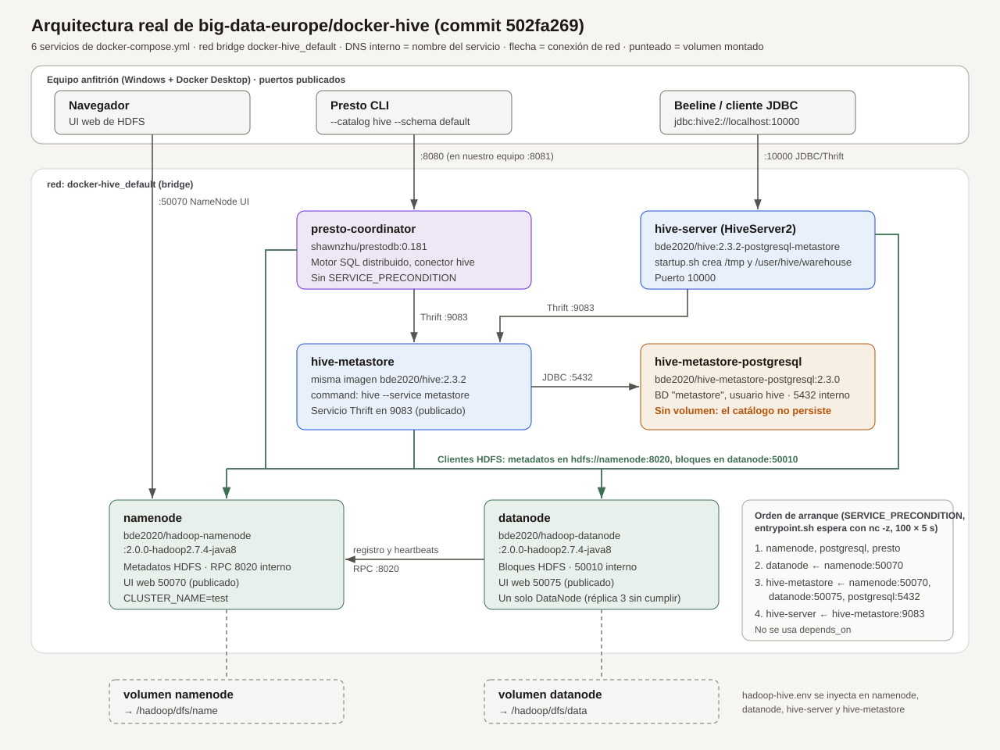

# LG14 — Investigación y despliegue de un repositorio Big Data con Docker

Grupo 3. Cuenta de entrega: [EduPantoja04](https://github.com/EduPantoja04).

Este repositorio documenta el análisis, el despliegue y la prueba funcional de un proyecto público de Big Data. No es un fork ni una copia renombrada de ese proyecto: el código que se ejecuta sigue viviendo en el repositorio original.

## Registro del repositorio analizado

| Campo | Valor |
| --- | --- |
| Estudiantes | Grupo 3 (completar nombres completos antes de enviarlo por Teams) |
| Repositorio | docker-hive |
| URL | https://github.com/big-data-europe/docker-hive |
| Autor / organización | Big Data Europe |
| Descripción | Entorno Docker Compose para Apache Hive 2.3.2 sobre HDFS, con metastore en PostgreSQL. |

Texto listo para pegar en el registro del curso:

```text
Nombre de los estudiantes: Grupo 3
Nombre del repositorio: docker-hive
URL: https://github.com/big-data-europe/docker-hive
Autor/organización: Big Data Europe
Descripción en una línea: Entorno Docker Compose para Apache Hive 2.3.2 sobre HDFS, con metastore en PostgreSQL.
```

## Por qué este repositorio y no Trino

[bitsondatadev/trino-getting-started](https://github.com/bitsondatadev/trino-getting-started) sí es Big Data y sí usa Docker Compose, pero no encaja bien con esta guía:

- No hay un único `docker-compose.yml` en la raíz. Son varios tutoriales y hay que entrar a un subdirectorio.
- La prueba obligatoria de la guía pide operaciones de HDFS: crear un directorio, cargar un archivo y consultarlo. Trino no almacena los datos; los consulta en otra fuente.
- Parte de los tutoriales se movió a `community-tutorials/` y el propio README advierte que pueden estar desactualizados.

`docker-hive` cumple las condiciones y deja una comparación real con [big-data-europe/docker-hadoop](https://github.com/big-data-europe/docker-hadoop). Son repositorios distintos: Hive reutiliza las imágenes Hadoop de esa organización, pero despliega un almacén SQL (HiveServer2, metastore y PostgreSQL) y no el clúster YARN del repositorio de referencia.

## 1. Información general

Datos tomados de la API de GitHub y del commit clonado para la práctica (`502fa269fe1913737ecfa0ef6ea05adb48b33868`, 6 de mayo de 2019).

| Campo | docker-hive |
| --- | --- |
| Nombre | docker-hive |
| Autor / organización | Big Data Europe |
| URL | https://github.com/big-data-europe/docker-hive |
| Fecha de creación | 20 de mayo de 2016 |
| Último commit en `master` | 6 de mayo de 2019 |
| Última actividad visible en GitHub | 29 de septiembre de 2026 (metadatos; el código de `master` no cambió en ese commit) |
| Estrellas | 1081 |
| Forks | 564 |
| Licencia | No declarada en el repositorio |
| Objetivo | Levantar Apache Hive 2.3.2 con HiveServer2 y un metastore respaldado por PostgreSQL, usando HDFS como sistema de archivos. |

## 2. Tecnologías

| Tecnología | Versión / detalle |
| --- | --- |
| Tecnología Big Data principal | Apache Hive, sobre HDFS |
| Hive | 2.3.2 |
| Hadoop | 2.7.4 (imágenes `bde2020/hadoop-namenode` y `bde2020/hadoop-datanode`, etiqueta `2.0.0-hadoop2.7.4-java8`) |
| Docker | Sí. La imagen de Hive parte de `bde2020/hadoop-base:2.0.0-hadoop2.7.4-java8` |
| Docker Compose | Sí. Archivo `docker-compose.yml` en la raíz, `version: "3"` |
| Sistema operativo base | Familia Debian: el `Dockerfile` instala paquetes con `apt-get` sobre la imagen Hadoop base, con Java 8 |
| Base de datos | PostgreSQL para el metastore (`bde2020/hive-metastore-postgresql:2.3.0`). El driver JDBC incluido es PostgreSQL 9.4.1212 |
| Frameworks adicionales | PrestoDB 0.181 (`shawnzhu/prestodb:0.181`), como coordinador opcional de consulta SQL |
| Lenguajes del repositorio | Shell (entrypoint, arranque y Makefile), Dockerfile, XML y properties de configuración. Hive y Hadoop son Java |

Hive no trae un clúster YARN propio. El archivo `hadoop-hive.env` incluye variables `YARN_CONF_*`, pero `docker-compose.yml` no define ResourceManager, NodeManager ni HistoryServer. Esas variables vienen del estilo de configuración de docker-hadoop y en este despliegue no tienen un proceso que las use.

## 3. Arquitectura

El archivo ejecutado es el `docker-compose.yml` de la raíz. Define **6 servicios**. Compose no les asigna `container_name`, así que Docker los nombra `docker-hive-<servicio>-1`. La red es la red bridge por defecto del proyecto (`docker-hive_default`): los servicios se resuelven por su nombre.

No hay un clúster YARN. El procesamiento SQL entra por HiveServer2 o por Presto, y el almacenamiento de archivos es un HDFS de un NameNode y un DataNode.



### Contenedores

| Contenedor | Imagen | Función | Puertos publicados | Volumen |
| --- | --- | --- | --- | --- |
| namenode | `bde2020/hadoop-namenode:2.0.0-hadoop2.7.4-java8` | Metadatos de HDFS y UI del NameNode. El sistema de archivos por defecto es `hdfs://namenode:8020` | 50070 | `namenode` → `/hadoop/dfs/name` |
| datanode | `bde2020/hadoop-datanode:2.0.0-hadoop2.7.4-java8` | Guarda los bloques de HDFS | 50075 | `datanode` → `/hadoop/dfs/data` |
| hive-metastore-postgresql | `bde2020/hive-metastore-postgresql:2.3.0` | Base del catálogo de Hive (esquemas y tablas, no los archivos) | 5432 solo dentro de la red | Ninguno |
| hive-metastore | `bde2020/hive:2.3.2-postgresql-metastore` | Servicio Thrift del metastore. El comando del compose reemplaza el arranque por `hive --service metastore` | 9083 | Ninguno |
| hive-server | `bde2020/hive:2.3.2-postgresql-metastore` | HiveServer2. Al arrancar crea `/tmp` y `/user/hive/warehouse` en HDFS | 10000 | Ninguno |
| presto-coordinator | `shawnzhu/prestodb:0.181` | Coordinador Presto para consultar el catálogo Hive por SQL | 8080 | Ninguno |

### Dependencias

El compose no usa `depends_on`. El orden lo impone `SERVICE_PRECONDITION`, y `entrypoint.sh` espera con `nc -z` hasta 100 intentos de 5 segundos:

| Servicio | Espera a |
| --- | --- |
| datanode | `namenode:50070` |
| hive-metastore | `namenode:50070`, `datanode:50075`, `hive-metastore-postgresql:5432` |
| hive-server | `hive-metastore:9083` |
| presto-coordinator | Nada. Puede quedar arriba aunque Hive todavía no responda |
| hive-metastore-postgresql | Nada |

En `hive-server` el compose declara `HIVE_CORE_CONF_javax_jdo_option_ConnectionURL=jdbc:postgresql://hive-metastore/metastore`. Ese prefijo no lo lee `entrypoint.sh`: solo convierte `HIVE_SITE_CONF_*` en propiedades de `hive-site.xml`. La URL que sí queda configurada es la de `hadoop-hive.env`, `jdbc:postgresql://hive-metastore-postgresql/metastore`, donde `hive-metastore-postgresql` es el contenedor de PostgreSQL y `hive-metastore` es el servicio Thrift.

### Variables de entorno

`hadoop-hive.env` se inyecta en NameNode, DataNode, HiveServer2 y metastore. `entrypoint.sh` convierte el prefijo y los guiones bajos en propiedades XML:

- `CORE_CONF_fs_defaultFS` → `fs.defaultFS=hdfs://namenode:8020`
- `HDFS_CONF_dfs_permissions_enabled=false` deja HDFS sin control de permisos, útil para la prueba local
- `HDFS_CONF_dfs_webhdfs_enabled=true`
- `HIVE_SITE_CONF_javax_jdo_option_ConnectionUserName=hive` y la contraseña `hive` (valores de ejemplo del repositorio público)
- `HIVE_SITE_CONF_hive_metastore_uris=thrift://hive-metastore:9083`

`conf/hive-site.xml` se entrega vacío. La configuración real se escribe al iniciar el contenedor.

### Archivos de configuración

| Archivo | Rol |
| --- | --- |
| `docker-compose.yml` | Servicios, imágenes, puertos y volúmenes |
| `hadoop-hive.env` | Propiedades de Hadoop y Hive |
| `Dockerfile` | Instala Hive 2.3.2 y el JDBC de PostgreSQL sobre la imagen Hadoop |
| `entrypoint.sh` | Genera los XML y espera las precondiciones |
| `startup.sh` | Prepara directorios HDFS y lanza HiveServer2 |
| `conf/` | `hive-site.xml` vacío, `hive-env.sh` y log4j de Hive |

Las copias usadas en este informe están en [`config/`](config/).

### Persistencia

Solo HDFS persiste, en los volúmenes nombrados `namenode` y `datanode`. PostgreSQL no tiene volumen: si se recrea ese contenedor, el catálogo de tablas se pierde aunque los archivos sigan en HDFS.
