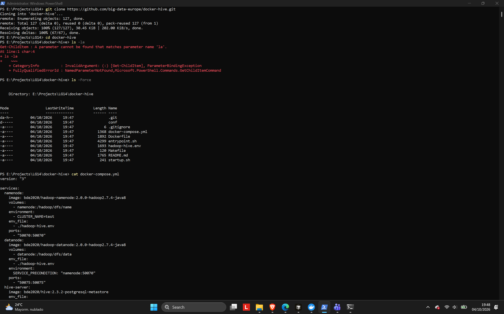
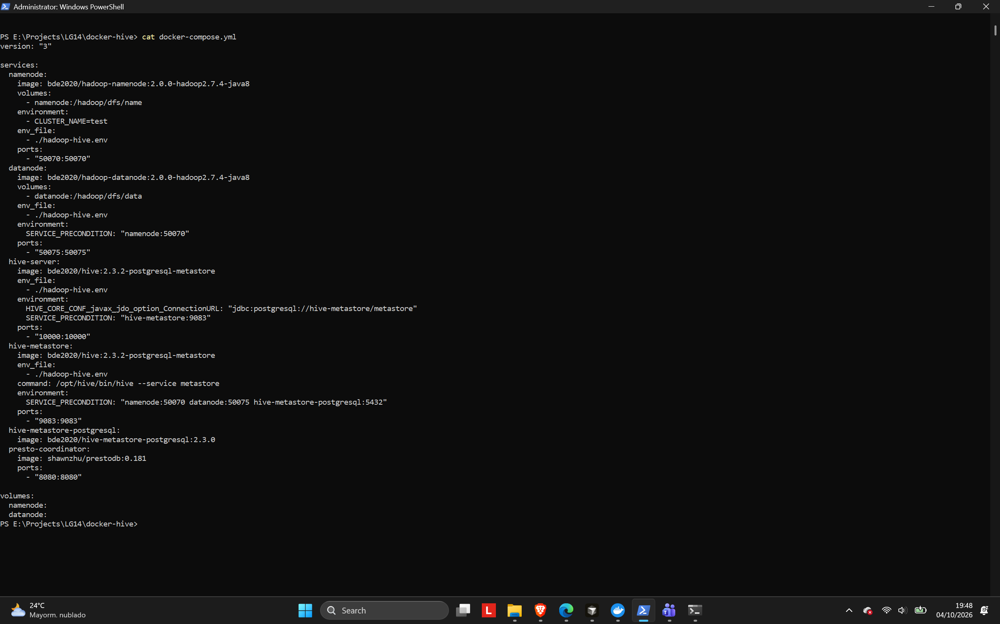
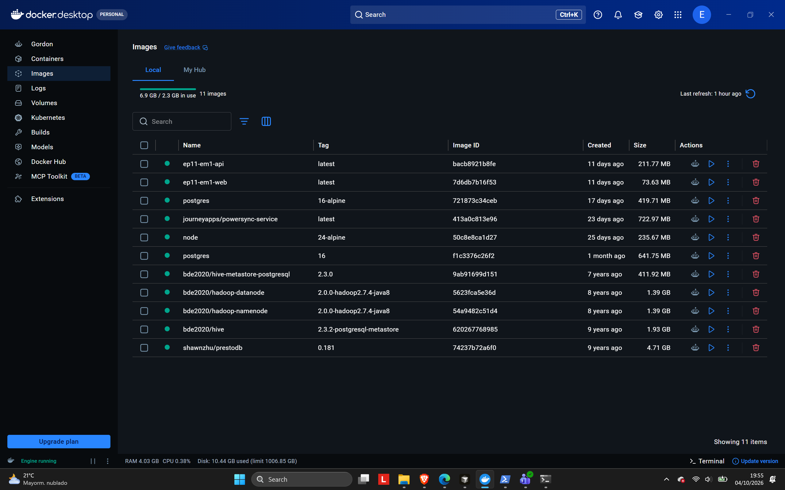
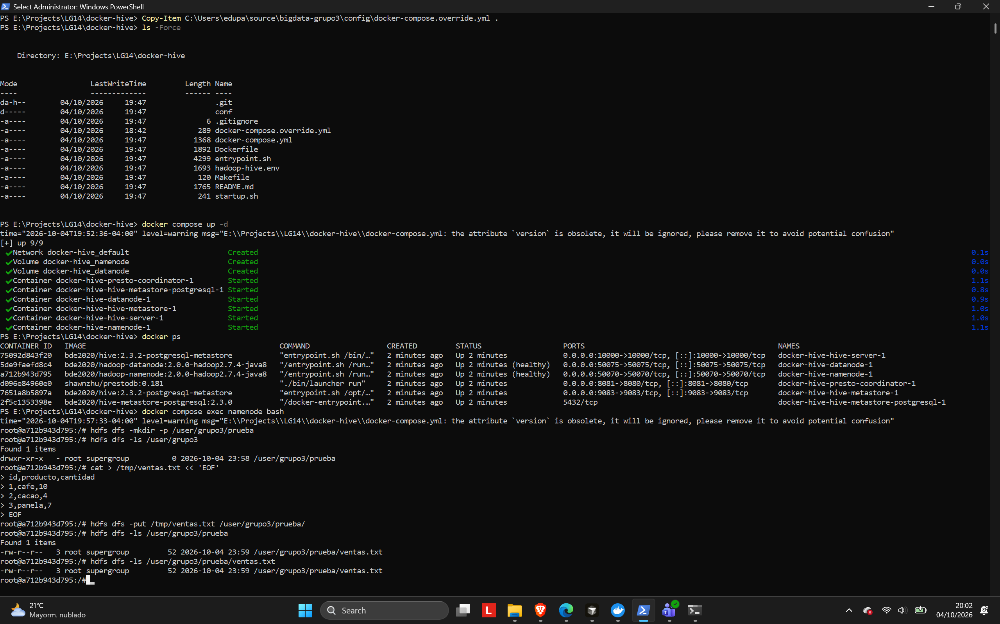
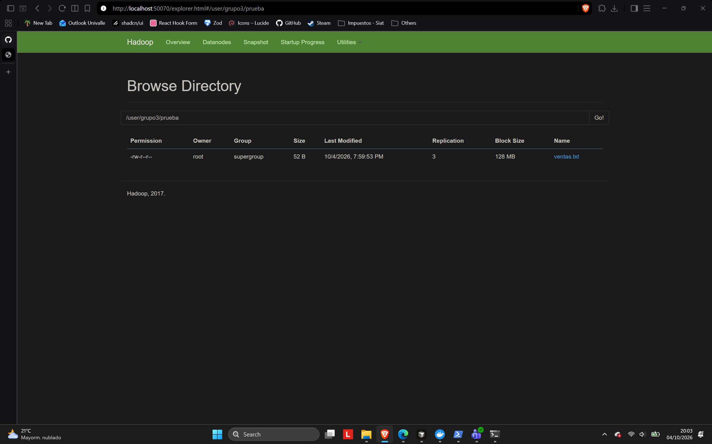
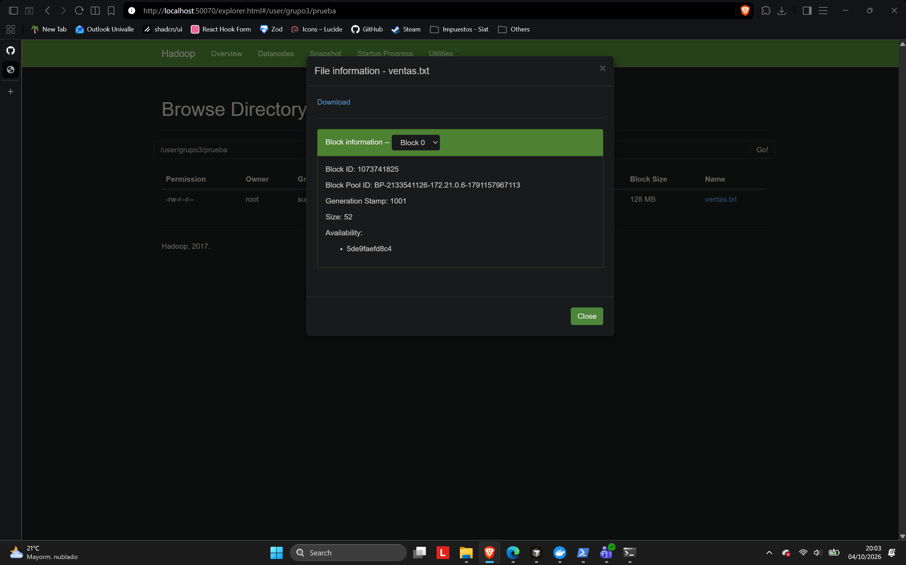

# LG14 — Investigación y despliegue de un repositorio Big Data con Docker

Universidad del Valle · Tecnologías Emergentes · Grupo 3

Este repositorio documenta el análisis, el despliegue y la prueba funcional de un proyecto público de Big Data. No es un fork ni una copia renombrada: el proyecto analizado se clona desde su repositorio original y aquí solo se guardan el informe, las copias de configuración usadas, los scripts propios y las evidencias.

## Registro del repositorio

| Campo | Valor |
| --- | --- |
| Estudiantes | Eduardo Antezana Jau, David Andres Escalera Rocha, Luis Eduardo Pantoja Fernandez |
| Repositorio | docker-hive |
| URL | https://github.com/big-data-europe/docker-hive |
| Autor / organización | Big Data Europe |
| Descripción | Entorno Docker Compose para Apache Hive 2.3.2 sobre HDFS, con metastore en PostgreSQL. |

## 1. Información general

Datos tomados de la API de GitHub y del commit clonado para la práctica (`502fa269fe1913737ecfa0ef6ea05adb48b33868`, 6 de mayo de 2019).

| Campo | docker-hive |
| --- | --- |
| Nombre | docker-hive |
| Autor / organización | Big Data Europe |
| URL | https://github.com/big-data-europe/docker-hive |
| Fecha de creación | 20 de mayo de 2016 |
| Último commit en `master` | 6 de mayo de 2019 |
| Última actividad visible en GitHub | 29 de septiembre de 2026 (metadatos; el código de `master` no cambió en ese commit) |
| Estrellas | 1081 |
| Forks | 564 |
| Licencia | No declarada en el repositorio |
| Objetivo | Levantar Apache Hive 2.3.2 con HiveServer2 y un metastore respaldado por PostgreSQL, usando HDFS como sistema de archivos. |

## 2. Tecnologías

| Tecnología | Versión / detalle |
| --- | --- |
| Tecnología Big Data principal | Apache Hive, sobre HDFS |
| Hive | 2.3.2 |
| Hadoop | 2.7.4 (imágenes `bde2020/hadoop-namenode` y `bde2020/hadoop-datanode`, etiqueta `2.0.0-hadoop2.7.4-java8`) |
| Docker | Sí. La imagen de Hive parte de `bde2020/hadoop-base:2.0.0-hadoop2.7.4-java8` |
| Docker Compose | Sí. Archivo `docker-compose.yml` en la raíz, `version: "3"` |
| Sistema operativo base | Familia Debian: el `Dockerfile` instala paquetes con `apt-get` sobre la imagen Hadoop base, con Java 8 |
| Base de datos | PostgreSQL para el metastore (`bde2020/hive-metastore-postgresql:2.3.0`). El driver JDBC incluido es PostgreSQL 9.4.1212 |
| Frameworks adicionales | PrestoDB 0.181 (`shawnzhu/prestodb:0.181`), como coordinador opcional de consulta SQL |
| Lenguajes del repositorio | Shell (entrypoint, arranque y Makefile), Dockerfile, XML y properties de configuración. Hive y Hadoop son Java |

Hive no trae un clúster YARN propio. El archivo `hadoop-hive.env` incluye variables `YARN_CONF_*`, pero `docker-compose.yml` no define ResourceManager, NodeManager ni HistoryServer. Esas variables vienen del estilo de configuración de docker-hadoop y en este despliegue no tienen un proceso que las use.

## 3. Arquitectura

El archivo ejecutado es el `docker-compose.yml` de la raíz. Define **6 servicios**. Compose no les asigna `container_name`, así que Docker los nombra `docker-hive-<servicio>-1`. La red es la red bridge por defecto del proyecto (`docker-hive_default`): los servicios se resuelven por su nombre.

No hay un clúster YARN. El procesamiento SQL entra por HiveServer2 o por Presto, y el almacenamiento de archivos es un HDFS de un NameNode y un DataNode.


El diagrama también está en PNG: [docs/arquitectura.png](docs/arquitectura.png).

Flujo de una consulta: el cliente (Beeline o Presto) pide al metastore, por Thrift en el puerto 9083, dónde están los datos y qué esquema tienen; el metastore guarda esa información en PostgreSQL. Con esa respuesta, HiveServer2 o Presto leen los archivos directamente de HDFS: piden la ubicación de los bloques al NameNode (8020) y leen los bloques del DataNode (50010).

### Contenedores

| Contenedor | Imagen | Función | Puertos publicados | Volumen |
| --- | --- | --- | --- | --- |
| namenode | `bde2020/hadoop-namenode:2.0.0-hadoop2.7.4-java8` | Metadatos de HDFS y UI del NameNode. El sistema de archivos por defecto es `hdfs://namenode:8020` | 50070 | `namenode` → `/hadoop/dfs/name` |
| datanode | `bde2020/hadoop-datanode:2.0.0-hadoop2.7.4-java8` | Guarda los bloques de HDFS | 50075 | `datanode` → `/hadoop/dfs/data` |
| hive-metastore-postgresql | `bde2020/hive-metastore-postgresql:2.3.0` | Base del catálogo de Hive (esquemas y tablas, no los archivos) | 5432 solo dentro de la red | Ninguno |
| hive-metastore | `bde2020/hive:2.3.2-postgresql-metastore` | Servicio Thrift del metastore. El comando del compose reemplaza el arranque por `hive --service metastore` | 9083 | Ninguno |
| hive-server | `bde2020/hive:2.3.2-postgresql-metastore` | HiveServer2. Al arrancar crea `/tmp` y `/user/hive/warehouse` en HDFS | 10000 | Ninguno |
| presto-coordinator | `shawnzhu/prestodb:0.181` | Coordinador Presto para consultar el catálogo Hive por SQL | 8080 | Ninguno |

La imagen de Hive declara `EXPOSE 10000` y `EXPOSE 10002` (UI web de HiveServer2), pero el compose solo publica 10000.

### Red

Una sola red, `docker-hive_default`, de tipo bridge, creada automáticamente por Compose (el archivo no declara `networks:`). Dentro de ella cada servicio se resuelve por su nombre: por eso `fs.defaultFS` es `hdfs://namenode:8020` y el metastore se encuentra en `thrift://hive-metastore:9083`. Los puertos internos que no se publican (8020, 50010, 5432) solo son accesibles entre contenedores.

### Dependencias

El compose no usa `depends_on`. El orden lo impone `SERVICE_PRECONDITION`, y `entrypoint.sh` espera con `nc -z` hasta 100 intentos de 5 segundos:

| Servicio | Espera a |
| --- | --- |
| datanode | `namenode:50070` |
| hive-metastore | `namenode:50070`, `datanode:50075`, `hive-metastore-postgresql:5432` |
| hive-server | `hive-metastore:9083` |
| presto-coordinator | Nada. Puede quedar arriba aunque Hive todavía no responda |
| hive-metastore-postgresql | Nada |

En `hive-server` el compose declara `HIVE_CORE_CONF_javax_jdo_option_ConnectionURL=jdbc:postgresql://hive-metastore/metastore`. Ese prefijo no lo lee `entrypoint.sh`: solo convierte `HIVE_SITE_CONF_*` en propiedades de `hive-site.xml`. La URL que sí queda configurada es la de `hadoop-hive.env`, `jdbc:postgresql://hive-metastore-postgresql/metastore`, donde `hive-metastore-postgresql` es el contenedor de PostgreSQL y `hive-metastore` es el servicio Thrift.

### Variables de entorno

`hadoop-hive.env` se inyecta en NameNode, DataNode, HiveServer2 y metastore. `entrypoint.sh` convierte el prefijo y los guiones bajos en propiedades XML:

- `CORE_CONF_fs_defaultFS` → `fs.defaultFS=hdfs://namenode:8020`
- `HDFS_CONF_dfs_permissions_enabled=false` deja HDFS sin control de permisos, útil para la prueba local
- `HDFS_CONF_dfs_webhdfs_enabled=true`
- `HIVE_SITE_CONF_javax_jdo_option_ConnectionUserName=hive` y la contraseña `hive` (valores de ejemplo del repositorio público)
- `HIVE_SITE_CONF_hive_metastore_uris=thrift://hive-metastore:9083`

`conf/hive-site.xml` se entrega vacío. La configuración real se escribe al iniciar el contenedor.

### Archivos de configuración

| Archivo | Rol |
| --- | --- |
| `docker-compose.yml` | Servicios, imágenes, puertos y volúmenes |
| `hadoop-hive.env` | Propiedades de Hadoop y Hive |
| `Dockerfile` | Instala Hive 2.3.2 y el JDBC de PostgreSQL sobre la imagen Hadoop |
| `entrypoint.sh` | Genera los XML y espera las precondiciones |
| `startup.sh` | Prepara directorios HDFS y lanza HiveServer2 |
| `conf/` | `hive-site.xml` vacío, `hive-env.sh` y log4j de Hive |

Las copias de esos archivos, tomadas del commit `502fa269`, están en [`config/`](config/). El único archivo agregado por el grupo es `docker-compose.override.yml`.

### Persistencia

Solo HDFS persiste, en los volúmenes nombrados `namenode` y `datanode`. PostgreSQL no tiene volumen: si se recrea ese contenedor, el catálogo de tablas se pierde aunque los archivos sigan en HDFS.

## 4. Comparación con docker-hadoop

El referente de la guía es [big-data-europe/docker-hadoop](https://github.com/big-data-europe/docker-hadoop). Comparten organización e imágenes `bde2020`, pero el compose, las versiones y el propósito no son los mismos. `docker-hive` no es un cambio de nombre de ese repositorio.

| Característica | docker-hadoop | docker-hive (este trabajo) |
| --- | --- | --- |
| Tecnología principal | Hadoop 3.2.1 (HDFS + YARN) | Hive 2.3.2 sobre Hadoop 2.7.4 |
| Docker | Sí | Sí |
| Docker Compose | Sí, `docker-compose.yml` en la raíz | Sí, `docker-compose.yml` en la raíz |
| Número de contenedores | 5: namenode, datanode, resourcemanager, nodemanager, historyserver | 6: namenode, datanode, hive-server, hive-metastore, hive-metastore-postgresql, presto-coordinator |
| Almacenamiento distribuido | HDFS. Volúmenes `hadoop_namenode`, `hadoop_datanode` y `hadoop_historyserver` | HDFS. Volúmenes `namenode` y `datanode`. Un solo DataNode |
| Procesamiento distribuido | YARN: ResourceManager y NodeManager | No hay YARN. La consulta es SQL por HiveServer2 y, si se usa, Presto |
| Interfaces web | El compose publica el NameNode en 9870 y el RPC en 9000. El README documenta además HistoryServer 8188, DataNode 9864, NodeManager 8042 y ResourceManager 8088 | NameNode 50070, DataNode 50075, Presto 8080. HiveServer2 es JDBC en 10000, no una UI web |
| Persistencia | Tres volúmenes nombrados para NameNode, DataNode e historial de YARN | Dos volúmenes de HDFS. El catálogo de PostgreSQL no tiene volumen |
| Complejidad de instalación | `docker compose up` y un `hadoop.env` | Igual de corta en comandos, con más servicios y una imagen extra de Presto. El stack es más viejo (Hadoop 2.7.4, Hive 2.3.2, Presto 0.181) |
| Documentación | README con URLs de las UI y la convención `CORE_CONF` / `HDFS_CONF` / `YARN_CONF` | README breve. Remite a docker-hadoop para la configuración de Hadoop e incluye un ejemplo con Beeline |
| Caso de uso | Clúster de ejemplo para almacenar en HDFS y ejecutar trabajos en YARN | Almacén de datos: tablas Hive sobre archivos en HDFS, con el catálogo en PostgreSQL |

La diferencia de propósito es la que importa. docker-hadoop muestra el sistema de archivos y el gestor de recursos. docker-hive se apoya en HDFS para guardar archivos y añade el catálogo y el motor SQL. Por eso la prueba de este grupo hace las tres operaciones de HDFS que pide la guía y, además, una consulta Hive sobre ese mismo archivo.

## 5. Implementación

Ejecutado el 4 de octubre de 2026 en Windows 11 (PowerShell), con Docker Desktop, Docker Engine 29.6.1 y Docker Compose v5.3.0.

### Paso 1 y 2: clonar e ingresar al directorio

```text
git clone https://github.com/big-data-europe/docker-hive.git
cd docker-hive
```

### Paso 3: identificar los archivos principales

`ls -la` es sintaxis de Linux. En PowerShell `ls` es un alias de `Get-ChildItem` y no acepta `-la`, por eso falla en la captura; el equivalente es `ls -Force`, que también muestra archivos ocultos como `.git` y `.gitignore`.



El listado también está en texto en [evidencias/01-archivos.txt](evidencias/01-archivos.txt). Los archivos que definen el despliegue son `docker-compose.yml`, `hadoop-hive.env`, `Dockerfile`, `entrypoint.sh`, `startup.sh` y `conf/`.

### Paso 4: analizar el docker-compose.yml



El análisis de cada servicio está en la [sección 3](#3-arquitectura).

### Paso 5: construir y ejecutar

```text
docker compose up -d
```

No hay que construir nada: el compose usa imágenes ya publicadas en Docker Hub (`bde2020/*` y `shawnzhu/prestodb`), que se descargan la primera vez. El `Dockerfile` solo hace falta si se quiere reconstruir la imagen de Hive con `make build`. Las imágenes descargadas suman unos 11 GB; la de Presto sola pesa 4,71 GB.



En el primer intento Presto no pudo publicar el puerto 8080 porque en este equipo lo usa el listener de Oracle (`TNSLSNR`). NameNode, DataNode, PostgreSQL, metastore y HiveServer2 sí quedaron en ejecución. Para no modificar el compose original se agregó [config/docker-compose.override.yml](config/docker-compose.override.yml), que Docker Compose combina automáticamente con `docker-compose.yml` y publica Presto en el host como `8081`. Con eso el sexto contenedor también arrancó.

Compose muestra el aviso `the attribute version is obsolete`: Compose v2 ignora la clave `version: "3"`, pero no es un error.

### Paso 6: verificar los contenedores

```text
docker ps
```

La captura muestra la red `docker-hive_default`, los volúmenes `docker-hive_namenode` y `docker-hive_datanode`, los seis contenedores en estado `Up` (NameNode y DataNode con `healthy`) y, a continuación, la prueba HDFS hecha a mano:



La salida de `docker ps` en texto está en [evidencias/02-docker-ps.txt](evidencias/02-docker-ps.txt). La UI del NameNode respondió HTTP 200 en http://localhost:50070/dfshealth.html ([evidencias/05-namenode-ui.txt](evidencias/05-namenode-ui.txt)).

En el log de `hive-server` se confirma la lectura real de la configuración: `javax.jdo.option.ConnectionURL=jdbc:postgresql://hive-metastore-postgresql/metastore`. El metastore anunció `Started the new metaserver on port [9083]` y HiveServer2 arrancó a las 22:39 UTC del mismo día.

## 6. Prueba funcional (paso 7)

La prueba obligatoria es de HDFS y se hizo dos veces: primero a mano dentro del NameNode y después con un script repetible.

### Prueba manual

Dentro de `docker compose exec namenode bash` (captura del paso 6):

```bash
hdfs dfs -mkdir -p /user/grupo3/prueba          # 1. crear directorio
hdfs dfs -ls /user/grupo3
cat > /tmp/ventas.txt << 'EOF'
id,producto,cantidad
1,cafe,10
2,cacao,4
3,panela,7
EOF
hdfs dfs -put /tmp/ventas.txt /user/grupo3/prueba/   # 2. cargar archivo
hdfs dfs -ls /user/grupo3/prueba                     # 3. consultar
```

El archivo quedó en HDFS con 52 bytes. El explorador web del NameNode (`Utilities → Browse the file system`) lo muestra en `/user/grupo3/prueba`, con réplica 3 y bloque de 128 MB:



Al abrir el archivo se ve que ocupa un solo bloque (`Block 0`, 52 bytes) y que está disponible en un único DataNode (`5de9faefd8c4`, que es el ID del contenedor `docker-hive-datanode-1` en `docker ps`):



### Prueba con script

El script [scripts/prueba-hdfs.sh](scripts/prueba-hdfs.sh) hace las tres operaciones dentro del NameNode:

1. Crea el directorio `/user/grupo3/prueba`.
2. Carga `ventas-grupo3.txt` (café, cacao y panela).
3. Lista el directorio y lee el archivo con `hdfs dfs -cat`.

Resultado guardado en [evidencias/03-prueba-hdfs.txt](evidencias/03-prueba-hdfs.txt):

```text
Found 1 items
-rw-r--r--   3 root supergroup   52 2026-10-04 22:43 /user/grupo3/prueba/ventas-grupo3.txt
id,producto,cantidad
1,cafe,10
2,cacao,4
3,panela,7
```

El `3` de la primera columna es el factor de réplica que trae Hadoop por defecto. En este compose solo hay un DataNode, así que el archivo se lee bien, pero no hay tres copias físicas.

### Prueba adicional con Hive

Como la tecnología principal del repositorio es Hive, la segunda prueba crea una tabla externa sobre esa misma ruta y la consulta con Beeline desde `hive-server`. No mueve el archivo: `LOAD DATA` lo sacaría de `/user/grupo3/prueba`. El script es [scripts/prueba-hive.sh](scripts/prueba-hive.sh) y el resultado está en [evidencias/04-prueba-hive.txt](evidencias/04-prueba-hive.txt):

```text
+-------------------+-------------------------+-------------------------+
| ventas_grupo3.id  | ventas_grupo3.producto  | ventas_grupo3.cantidad  |
+-------------------+-------------------------+-------------------------+
| 1                 | cafe                    | 10                      |
| 2                 | cacao                   | 4                       |
| 3                 | panela                  | 7                       |
+-------------------+-------------------------+-------------------------+
```

Esta consulta recorre toda la arquitectura: Beeline habla con HiveServer2, HiveServer2 registra la tabla en el metastore (que la guarda en PostgreSQL) y lee el archivo desde HDFS. Si `SELECT` devuelve las filas, los cinco contenedores del camino de Hive (todos menos Presto) están funcionando y conectados.

## 7. Problemas encontrados

| Problema | Causa | Solución |
| --- | --- | --- |
| `ls -la` falla | En PowerShell `ls` es `Get-ChildItem` | `ls -Force` |
| Presto no arranca: puerto 8080 ocupado | El listener de Oracle (`TNSLSNR`) usa 8080 en el equipo | `docker-compose.override.yml` publica Presto en 8081 sin tocar el compose original |
| Aviso `version is obsolete` | Compose v2 ignora la clave `version` | Ninguna, es solo un aviso |
| Réplica 3 con un solo DataNode | `dfs.replication` queda en su valor por defecto | Ninguna para la prueba. Para un clúster real habría que agregar DataNodes o poner `HDFS_CONF_dfs_replication=1` |
| Scripts `.sh` con finales de línea de Windows | Git en Windows convierte LF a CRLF y `bash` falla con `\r` | Los scripts `.ps1` convierten a LF antes de copiar al contenedor y `.gitattributes` fuerza LF en `*.sh` |

## 8. Cómo repetir la ejecución

Desde PowerShell, con Docker Desktop encendido:

```powershell
.\scripts\desplegar.ps1                 # clona, lista archivos, docker compose up -d y docker ps
.\scripts\prueba-hdfs.ps1               # crear directorio, cargar y consultar en HDFS
.\scripts\prueba-hive.ps1               # tabla externa y SELECT con Beeline
```

Si el puerto 8080 está ocupado en el equipo, usar `.\scripts\desplegar.ps1 -PrestoEn8081`, que copia el override antes de levantar el clúster.

Para apagar el clúster sin borrar los volúmenes de HDFS:

```powershell
Set-Location "$env:USERPROFILE\source\docker-hive"
docker compose stop
```

`docker compose down -v` sí borra los volúmenes `namenode` y `datanode`.

## 9. Conclusiones

- docker-hive no es un clúster Hadoop completo: reutiliza solo la parte de almacenamiento (HDFS) de las imágenes de docker-hadoop y le agrega una capa de almacén de datos SQL. No tiene YARN, así que las consultas de Hive se ejecutan en modo local dentro de HiveServer2.
- La separación entre datos y metadatos es la idea central: los archivos viven en HDFS (con volúmenes persistentes) y el esquema de las tablas vive en PostgreSQL (sin volumen). Por eso, al recrear el contenedor de PostgreSQL, los archivos sobreviven pero las tablas hay que volver a declararlas.
- La configuración se hace por variables de entorno (`CORE_CONF_*`, `HDFS_CONF_*`, `HIVE_SITE_CONF_*`) que `entrypoint.sh` traduce a XML al arrancar. Esto permite cambiar Hadoop o Hive sin reconstruir imágenes, pero un prefijo mal escrito, como `HIVE_CORE_CONF_` en `hive-server`, se ignora sin dar error.
- El orden de arranque depende de `SERVICE_PRECONDITION` y no de `depends_on`: cada contenedor espera activamente a que el puerto del anterior responda, lo que es más fiable que solo esperar a que el contenedor exista.
- La prueba confirmó el ciclo completo que pide la guía (crear directorio, cargar archivo y consultarlo en HDFS) y, además, que Hive puede consultar ese mismo archivo como tabla SQL sin moverlo.

## Estructura de este repositorio

```text
README.md
.gitignore
.gitattributes   fuerza LF en *.sh, *.env y *.yml
config/          copias de docker-compose.yml, hadoop-hive.env, Dockerfile,
                 entrypoint.sh, startup.sh, Makefile y conf/ del commit 502fa269,
                 más el override local del puerto 8081
docs/            diagrama de la arquitectura real (SVG y PNG)
scripts/         despliegue y pruebas (PowerShell + bash)
evidencias/      capturas y salidas de docker ps, HDFS, UI del NameNode y Hive
```

El `.gitignore` es propio de este informe. No usa una plantilla de lenguaje de GitHub: el repositorio no es una aplicación Java o Python, y una plantilla de ese tipo ignoraría archivos que sí hay que entregar. Ignora datos locales de HDFS, logs, secretos `.env` y el clon de trabajo.
